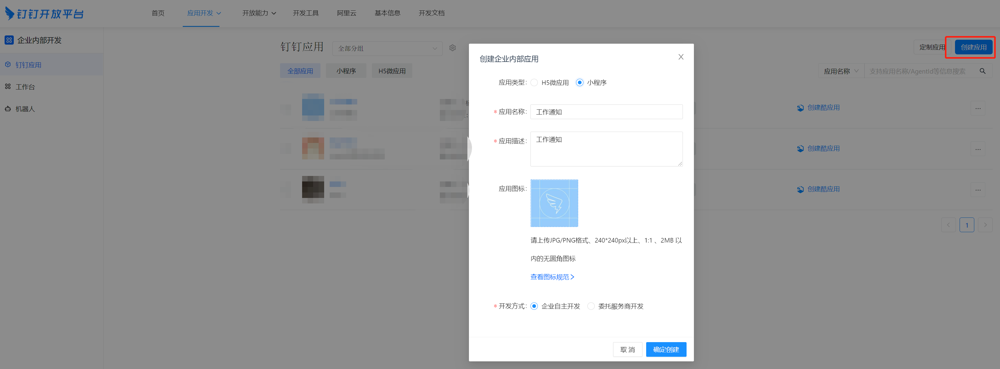
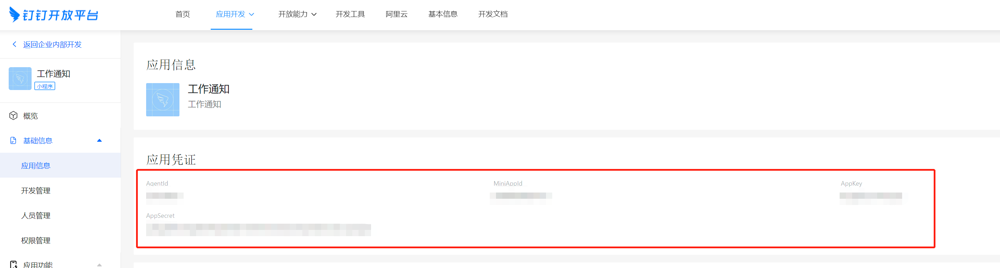
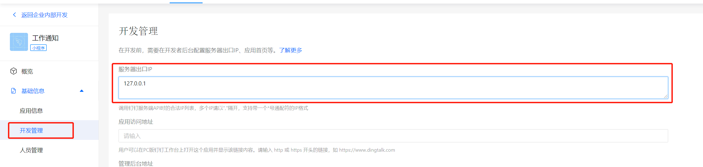
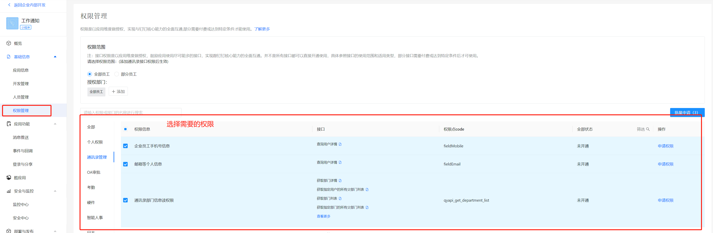

# 钉钉工作通知对接

## 背景
公司采用钉钉作为办公软件，有时就需要我们向特定某个员工推送消息，包括但不限于服务预警，审批通知等。
面向群通知的群消息机器人无法满足特定用户数据权限的控制，这就有了通过钉钉工作通知给个人发消息的需求。

**工作通知**就是企业“工作通知”会话中某个微应用的名义推送到员工的通知消息。

## 准备工作
接入前可以先阅读 [企业内部应用开发介绍](https://open.dingtalk.com/document/org/orgapp-development-process)
，内含详细的图文说明。

### 1. 新增一个小程序
到 [钉钉开发后台](https://open-dev.dingtalk.com/#/) 创建一个钉钉小程序应用



### 2. 保存应用凭证
需要保存应用的认证信息，用于后续服务端开发



### 3. 开发配置
钉钉服务端需要配置ip白名单



### 4. 权限配置
最后配置应用需要的权限




## python客户端

钉钉微应用开发需要参考 [企业内应用开发-服务端](https://open.dingtalk.com/document/orgapp-server/how-to-call-apis) ，接口文档比较详尽。

python客户端的对接方案有：
* 自行对接OpenAPI
* 阿里云提供的python sdk包 [地址](https://open.dingtalk.com/document/orgapp-server/sdk-download)
* 开源项目dingtalk-sdk [地址](https://github.com/007gzs/dingtalk-sdk)

实际开发时，我们选择的方案是基于dingtalk-sdk进行开发，原因如下:
* dingtalk-sdk提供了统一的client入口，使用方便，并对接了几乎所有的OpenAPI
* client支持access_token的缓存和失效更新
* 贡献者较多，文档比较齐全。和另一个比较有名的非官方sdk项目wechatpy的贡献者重合
* 源码可读性高，可拓展性强，是很优秀的一个Python对接某系统OpenAPI的模板
* 相对于阿里云提供的sdk，dingtalk-sdk的api使用上更符合pythonic风格的代码


## 服务端开发 - 基于dingtalk-sdk的钉钉应用服务端开发
实际开发中我们会对dingtalk-sdk的client进行一次封装

服务端开发需要解决的主要有以下几个问题：
* 封装app_key, app_secret等认证信息的注入，方便调用
* 添加代理钩子，在客户端层面支持代理应对钉钉的ip白名单
* 需要重写async_send支持长内容工作通知的发送

### client封装示例
settings.py
```python
DINGTALK_APP_KEY = 'YOUR_APP_KEY'
DINGTALK_APP_SECRET = 'YOUR_APP_SECRET'
DINGTALK_APP_AGENT_ID = 'YOUR_APP_AGENT_ID'
DINGTALK_PROXIES = {
    'https': 'YOUR_PROXY'
}

```

client.py
```python
from django.conf import settings
from dingtalk.client import AppKeyClient
from dingtalk.model.message import TextBody


class Client(AppKeyClient):
    """ dingtalk-sdk客户端，封装认证和代理等 """
    def __init__(self, agent_id=None, app_key=None, app_secret=None, proxies=None):
        app_key = app_key or settings.DINGTALK_APP_KEY
        app_secret = app_secret or settings.DINGTALK_APP_SECRET
        self.agent_id = agent_id or settings.DINGTALK_APP_AGENT_ID
        self.proxies = proxies or settings.DINGTALK_PROXIES
        super().__init__('', app_key, app_secret)

    def _request(self, method, url_or_endpoint, **kwargs):
        """ 钉钉服务需要ip白名单，这里添加支持代理 """
        kwargs.setdefault('proxies', self.proxies)
        return super()._request(method, url_or_endpoint, **kwargs)

    def async_send(self, userid_list, msg, **kwargs):
        """ 异步发送消息，dingtalk-sdk提供的top_request请求方式发送长消息会导致url过长，413 FULL HEAD报错 """
        if isinstance(msg, str):
            msg = TextBody(content=msg)
        if isinstance(userid_list, (list, tuple, set)):
            userid_list = ",".join(map(to_text, userid_list))
        if not userid_list:
            userid_list = None
        if isinstance(msg, BodyBase):
            msg = msg.get_dict()

        task_id = self.post(
            '/topapi/message/corpconversation/asyncsend_v2',
            {
                "msg": msg,
                'agent_id': self.agent_id,
                'userid_list': userid_list,
                'to_all_user': 'false',
            },
            result_processor=lambda x: x['task_id']
        )
        return task_id
```


### 企业内用户信息获取
给具体用户发送消息需要知道用户的userid。以下提供了一种获取系统内用户userid的方案
1. `department/list`接口获取所有部门，[接口文档](https://open.dingtalk.com/document/orgapp-server/obtains-a-list-of-industry-departments)
2. `user/list`接口获取部门下所有用户，[接口文档](https://open.dingtalk.com/document/orgapp-server/obtains-the-list-of-people-under-a-department)
3. 对获取到的用户根据userid去重（可能存在一个用户多的部门的情况）

示例代码
```python
from client import Client

client = Client()

def fetch_dept_users(dept_id):
    """ 获取部门内用户信息 """
    offset, page_size = 0, 100
    result = client.user.list(dept_id, offset=offset, size=page_size)
    user_list = result.userlist

    while result.errcode == 0 and result.hasMore:
        offset += page_size
        result = client.user.list(dept_id, offset=offset, size=page_size)
        user_list.extend(user_list)
    return user_list
    
def fetch_all_user():
    """ 获取所有部门用户 """
    user_list = []
    dept_list = client.department.list(fetch_child=True)
    
    for dept in dept_list:
        user_list.extend(self.fetch_dept_users(dept.id))
    return user_list
```
