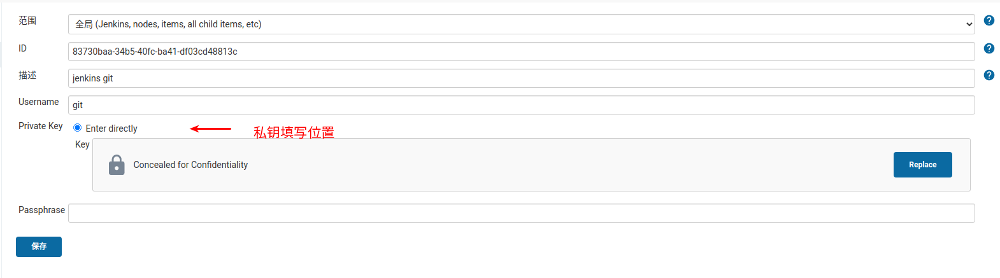
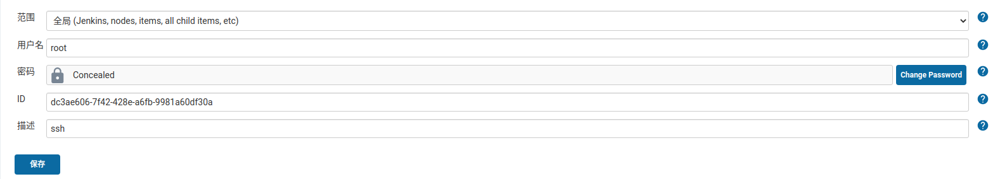

# Jenkins基础

> 原文 https://jenkins.io/doc/book/installing/

## 安装之前

最低配置:
* 256 MB of RAM
* 1 GB of drive space (although 10 GB is a recommended minimum if running Jenkins as a Docker (https://jenkins.io/doc/book/installing/#docker) container)

推荐配置:
* 1 GB+ of RAM
* 50 GB+ of drive space

软件配置:
* Java: see the Java Requirements (https://jenkins.io/doc/administration/requirements/java) page
    * 当前只有Java 8支持
* Web browser: see the Web Browser Compatibility (https://jenkins.io/doc/administration/requirements/web-browsers) page


### Linux（Debian/Ubuntu）

直接使用apt安装
```bash
wget -q -O - https://pkg.jenkins.io/debian/jenkins.io.key | sudo apt-key add -
sudo sh -c 'echo deb http://pkg.jenkins.io/debian-stable binary/ > /etc/apt/sources.list.d/jenkins.list'
sudo apt-get update
sudo apt-get install jenkins
```

安装之后配置：

* 启动/etc/init.d/jenkins
* 需要创建一个jenkins用户来跑这个service
* log文件/var/log/jenkins/jenkins.log必须存在
* 修改/etc/default/jenkins来配置启动参数（例如监听端口等等）


### Docker安装

run.sh内容
```bash
basepath=$(cd `dirname $0`; pwd)
sudo docker run -d -p 7010:8080 -p 7011:50000 \
         -v $basepath/data/jenkins_home:/var/jenkins_home \
         -u 0 --restart=always --name jenkins jenkins:latest
```


## 操作说明

### 配置权限不对导致登录页面空白页问题：

修改 /var/lib/jenkins/config.xml 文件，替换下面两个tag，然后重启服务即可。
```xml
<authorizationStrategy class="hudson.security.AuthorizationStrategy$Unsecured"/>
  <securityRealm class="hudson.security.SecurityRealm$None"/>
```


### 配置认证信息
常用的认证信息类型有两种：

##### 私钥(SSH Username with private key)


> [!Note]
> 使用ssh方式的git remote需要用私钥的方式配置


##### 账号密码(Username with password)


