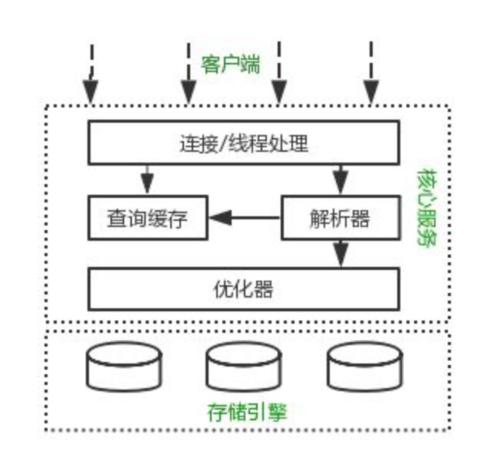

# MySQL架构

## 服务器架构介绍

最上层的服务并不是MySQL所独有的，大多数基于网络的客户端/服务器的工具或者服务都有类似的架构。比如连接处理授权认证、安全等等。

第二层架构是MySQL比较有意思的部分。大多数MySQL的核心服务功能都在这一层，包括查询解析、分析、优化、缓存以及所有的内置函数
(例如，日期、时间、数学和加密函数)，所有跨存储引擎的功能都在这一层实现：存储过程触发器、视图等。

第三层包含了存储引擎。存储引擎负责MySQL中数据的存储和提取。和GNU/Linux下的各种文件系统一样，每个存储引擎都有它的优势和劣势.
服务器通过API与存储引擎进行通信。这些接口屏蔽了不同存储引擎之间的差异，使得这些差异对上层的查询过程透明。存储引擎API包含几十个底层函数，
用于执行诸如“开始一个事务”或者“根据主键提取一行记录”等操作。但存储引擎不会去解析SOL不同存储引擎之间也不会相互通信，而只是简单地响应上层服务器的请求。

## MySQL中的存储引擎
### InnoDB
InnoDB是MySQL默认的存储引擎，支持事务。
* 可以通过自动增长列，方法是auto_increment。
* 支持事务。默认的事务隔离级别为可重复读(RR)，通过MVCC（并发版本控制）来支持高并发；
* 使用的锁粒度为行级锁，可以支持更高的并发；
* 支持外键约束；外键约束其实降低了表的查询速度，但是增加了表之间的耦合度；
* 配合一些热备工具可以支持在线热备份；
* 在InnoDB中存在着缓冲管理，通过缓冲池，将索引和数据全部缓存起来，加快查询的速度；
* 对于InnoDB类型的表，其数据的物理组织形式是聚簇表。所有的数据按照主键来组织。数据和索引放在一块，都位于B+数的叶子节点上；

### MyISAM
MySQL5.1之前的默认存储引擎，不支持事务。
* MyISAM支持全文索引，而InnoDB不支持；
* 不支持事务和行级锁；
* 如果你的读写操作允许有错误数据的话，只是追求速度，可以选择这个存储引擎；

### MEMORY
将数据存在内存，为了提高数据的访问速度，每一个表实际上和一个磁盘文件关联。文件是frm。
* 支持的数据类型有限制，比如：不支持TEXT和BLOB类型，对于字符串类型的数据，只支持固定长度的行，VARCHAR会被自动存储为CHAR类型；
* 支持的锁粒度为表级锁。所以，在访问量比较大时，表级锁会成为MEMORY存储引擎的瓶颈；
* 由于数据是存放在内存中，一旦服务器出现故障，数据都会丢失；
* 查询的时候，如果有用到临时表，而且临时表中有BLOB，TEXT类型的字段，那么这个临时表就会转化为MyISAM类型的表，性能会急剧降低；
* 默认使用hash索引；
* 如果一个内部表很大，会转化为磁盘表；

### 选择存储引擎的考察点
* 事务
* 备份
* 奔溃恢复
* 特有的特性
* 一般没有特殊需求，选择InnoDB就是了。
