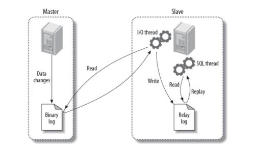

# 复制

复制解决的基本问题是让一台服务器的数据与其他服务器保持同步。
一台主库的数据可以同步到多台备库上，备库本身也可以被配置为另一台服务器的主库。主库和备库之间可以有多种不同的组合方式。

## 概述
### MySQL支持两种复制方式
* 基于行的复制
* 基于语句的复制
这两种方式都是通过在主库上记录binlog，在备库重放日志的方式实现异步的数据复制。
这意味着，在同一时间点，备库上的数据可能与主库存在不一致，并且无法保证主备之间的延迟。一些大的语句可能导致备库产生几秒、几分钟甚至几小时的延迟。

### 复制解决的问题
* 数据分布
* 负载均衡
* 备份
* 高可用性和故障切换
* MySQL升级测试

### MySQL如何复制
总的来说，复制有三个步骤：
1. 在主库上把数据更改记录到二进制日志（Binary Log）中（这些记录被称为二进制日志事件）
2. 备库将主库上的日志复制到自己的中继日志（Relay Log）中。
3. 备库读取中继日志中的事件，将其重放到备库数据之上。



这种复制架构实现了获取事件和重放事件的解耦，允许这两个过程异步进行。也就是说IO线程能够独立于SQL线程之外工作。
但这种架构也限制了复制的过程，其中最重要的一点是在主库上并发运行的查询在备库上只能串行化执行，因为只有一个SQL线程来重放Relay Log的事件。

## 配置复制
配置的主要步骤：
1. 在每台服务器上创建复制账号;
2. 配置主库和备库;
3. 通知备库连接到主库并从主库复制数据;

### 创建复制账号
```bash
mysql> CREATE USER repl@'172.18.0.%' IDENTIFIED BY 'password'; 
mysql> GRANT REPLICATION SLAVE, REPLICATION CLIENT ON *.* TO repl@'172.18.0.%'; 
```

### 添加配置
主库
```
server_id       = 2
log_bin         = /var/lib/mysql/mysql-bin
```
从库
```
log_bin         = mysql-bin
server_id       = 3
relay_log       = /var/lib/mysql/mysql-relay-bin
log_slave_updates = 1
read_only       = 1
```

### 启动复制
查看主库情况
```bash
mysql> show master status;
+------------------+----------+--------------+------------------+-------------------+
| File             | Position | Binlog_Do_DB | Binlog_Ignore_DB | Executed_Gtid_Set |
+------------------+----------+--------------+------------------+-------------------+
| mysql-bin.000001 |      156 |              |                  |                   |
+------------------+----------+--------------+------------------+-------------------+
```
从库启动配置
```bash
mysql> CHANGE MASTER TO MASTER_HOST='172.18.0.2', MASTER_USER='repl', MASTER_PASSWORD='password', 
       MASTER_LOG_FILE='mysql-bin.000001', MASTER_LOG_POS=0;
Query OK, 0 rows affected, 7 warnings (0.03 sec)

mysql> show slave status \G
*************************** 1. row ***************************
               Slave_IO_State:
                  Master_Host: 172.18.0.2
                  Master_User: repl
                  Master_Port: 3306
                Connect_Retry: 60
              Master_Log_File: mysql-bin.000001
          Read_Master_Log_Pos: 4
               Relay_Log_File: mysql-relay-bin.000001
                Relay_Log_Pos: 4
        Relay_Master_Log_File: mysql-bin.000001
             Slave_IO_Running: No
            Slave_SQL_Running: No
                               ...omitted...
        Seconds_Behind_Master: NULL
1 row in set, 1 warning (0.01 sec)

mysql> start slave;
Query OK, 0 rows affected, 1 warning (0.02 sec)

mysql> show slave status \G
*************************** 1. row ***************************
               Slave_IO_State: Waiting for master to send event
                  Master_Host: 172.18.0.2
                  Master_User: repl
                  Master_Port: 3306
                Connect_Retry: 60
              Master_Log_File: mysql-bin.000001
          Read_Master_Log_Pos: 156
               Relay_Log_File: mysql-relay-bin.000003
                Relay_Log_Pos: 371
        Relay_Master_Log_File: mysql-bin.000001
             Slave_IO_Running: Yes
            Slave_SQL_Running: Yes
                               ...omitted...
        Seconds_Behind_Master: 0
1 row in set, 1 warning (0.02 sec)
```

##### 异常情况
> Slave failed to initialize relay log info structure from the repository

重置slave
```bash
mysql> reset slave;
Query OK, 0 rows affected, 1 warning (0.02 sec)
```

## 已有数据开始复制
前面的设置都是假定主库备库都是刚刚安装好且都是默认的数据，也就是说两台服务器上数据相同，并且知道当前主库的二进制日志。
这不是典型的案例，大多数情况下有一个已经运行了一段时间的主库，然后用一台新安装的备库与之同步，此时备库还没有数据。

需要有三个条件来让主库和备库保持同步：
* 在某个时间点的主库的数据快照;
* 主库当前的二进制日志文件，和获得数据快照时在该binlog中的偏移量（这两个值称为日志文件坐标，这两个值可以确定二进制日志的位置，可以通过`SHOW MASTER STATUS`获取）
* 快照时间到现在的二进制日志

### mysqldump
```bash
$ mysqldump -h server1 --master-data=1 --all-databases > dump.sql
$ mysql -h server2 < dump.sql
```


## 常见问题

### Last_SQL_Error: Could not execute Delete_rows event 
由于master要删除一条记录，而slave上找不到故报错，这种情况master和slave都将其删除了，那么slave可以直接跳过。
```bash
mysql> stop slave;
mysql> set global sql_slave_skip_counter=1;
mysql> start slave;
```
