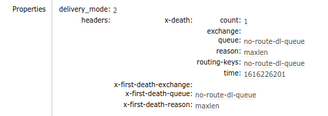

# 死信

官方文档: https://www.rabbitmq.com/dlx.html

交换机接收到的消息除了来自生产者，还可能来自`死信（dead letter）`。			

## 概念

### 死信的来源
* 由于`basic.reject`或`basic.nack`等指令且`requeue=False`的消息
* 消息的ttl到期失效移出队列
* 因为队列消息数超过队列长度而被丢弃的消息


### 死信交换机(DLX)
死信交换机通过队列声明时的`x-dead-letter-exchange`参数指定


### 死信的`routing key`
* 如果队列配置了`x-dead-letter-routing-key`，则使用`x-dead-letter-routing-key`作为死信的`routing key`
* 反之，按照消息投入队列时的`routing key`投递到DLX中


### 死信在消息上的影响
投入到死信队列的消息将会改变一些消息的信息



## 应用

### 延时队列
通过给delay队列消息设置失效时间和给队列配置DLX，消费者只处理DLX指向的死信队列，达到延迟队列的效果

生产者
```python
import pika
import datetime


conn = pika.BlockingConnection(pika.ConnectionParameters('localhost'))
channel = conn.channel()
# 声明处理队列
channel.queue_declare('handler', durable=True)
channel.exchange_declare('dlx', exchange_type='direct')
channel.queue_bind(queue='handler', exchange='dlx', routing_key='dl_key')
# 声明延时队列
arguments = {
    'x-message-ttl': 15*1000,
    'x-dead-letter-exchange': 'dlx',
    'x-dead-letter-routing-key': 'dl_key',
}
channel.queue_declare('delay', durable=True, arguments=arguments)

message = f'message send at {datetime.datetime.now()}. It may delay 15 seconds'
channel.basic_publish(
            exchange='', 
            routing_key='delay', 
            body=message.encode()
        )
print(f'Publish: {message}')
```

消费者
```python
import pika
import datetime


conn = pika.BlockingConnection(pika.ConnectionParameters('localhost'))
channel = conn.channel()
# 声明处理队列
channel.queue_declare('handler', durable=True)
channel.exchange_declare('dlx', exchange_type='direct')
channel.queue_bind(queue='handler', exchange='dlx', routing_key='dl_key')


def callback(ch, method, properties, body):
    print(f'Received in {datetime.datetime.now()}: {body.decode()}')
    ch.basic_ack(delivery_tag=method.delivery_tag)

channel.basic_qos(prefetch_count=1)
channel.basic_consume('handler', on_message_callback=callback)
print('start consuming...')
channel.start_consuming()
```
