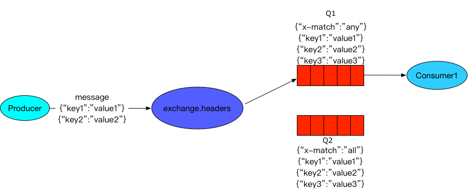

# 快速上手

RabbitMQ是一款开源消息中间件，是AMQP的一种实现。


## 最简单模型
     
这个模型由三部分组成：
* 生产者(Producer): 发送消息的应用程序
* 队列(Queue): 存储消息的缓存区
* 消费者(Consumer): 等待接收消息的处理程序

### 发送消息到队列
```python
# send.py
import pika

# 建立连接
connection = pika.BlockingConnection(pika.ConnectionParameters('localhost'))
# 获取channel
channel = connection.channel()
# 声明队列
channel.queue_declare(queue='hello')
# 发送一条消息"hello world"
channel.basic_publish(exchange='',
                      routing_key='hello',
                      body='Hello World!')
# 断开连接
connection.close()
```

### 从队列接收消息
```python
# receive.py
import pika

connection = pika.BlockingConnection(pika.ConnectionParameters('localhost'))
channel = connection.channel()
# 声明队列(queue_declare操作是幂等的，两边都声明队列确保队列存在)
channel.queue_declare(queue='hello')

# 定义一个回调函数
def callback(ch, method, properties, body):
    print(" [x] Received %r" % body)

# 绑定回调函数到basic_consume
channel.basic_consume(queue='hello',
                      auto_ack=True,
                      on_message_callback=callback)
# 开始消费
channel.start_consuming()
```


## ack
当一个消费者处理一条消息时，RabbitMQ会将这条消息从`Ready`流转到`Unacked`。只有消费者向RabbitMQ发送ack之后，RabbitMQ才会将这条消息标记删除。
当消费者挂断/断开连接时，消息又会流转回`Ready`状态。
> [!Warning]        
> 在实践中，一般不会像上例那样传参`auto_ack=True`，都会手动ack，防止消费者在处理过程中异常时消息也被消费掉。

上例消费者可以改成
```python
def callback(ch, method, properties, body):
    print(" [x] Received %r" % body)
    # 手动ack，delivery_tag为该消费者的计数，每次加1，delivery_tag置零可以起到unack的效果
    ch.basic_ack(delivery_tag=method.delivery_tag)

channel.basic_consume(queue='hello', on_message_callback=callback)
```


## 持久化
RabbitMQ已经保证了消费者挂掉时消息不会丢失，还需要确保RabbitMQ服务挂掉时消息不丢失，所以队列和消息都应该持久化。

### 队列持久化    
声明队列时指定`durable=True`
```python
channel.queue_declare(queue='hello', durable=True)
```
> [!Warning]        
> 虽然`queue_declare`是幂等的，但是RabbitMQ不允许使用不同的参数声明现有队列，并且将向任何尝试这样做的程序返回错误。
> 所以只能将当前队列删除或者换一个队列名

### 消息持久化
指定消息属性参数`delivery_mode=2`
```python
channel.basic_publish(exchange='',
                      routing_key="hello",
                      body=message,
                      properties=pika.BasicProperties(
                         delivery_mode=2,   # 消息持久化
                      ))
```
以上并不能保证消息完全不丢失，因为虽然声明了消息持久化，但是消息也可能只是存储在缓存中，并不会立即写入磁盘。          
RabbitMQ提供了一个确保消息不丢失方案：Publisher Confirm(发布者确认，RabbitMQ对AMQP的拓展，由于pika是amqp的python客户端实现，所以并没有实现这一功能)        
文档：https://www.rabbitmq.com/confirms.html

> [!Note|label:队列容量]       
> 需要注意队列的长度，如果worker消费跟不上，队列总会被填满，所以可以通过监控队列适当添加worker，或者指定消息的TTL


## 调度算法

### 循环调度
RabbitMQ的默认调度方法，将消息循环地发送给正在监听的消费者，不会查看当前消费者`Unacked`的消费数。
也就可能会导致有些消费者一直在处理轻松的任务，有些消费者一直在处理繁重的任务。

### 公平调度
RabbitMQ只是在消息进入队列时发送消息。它不会查看消费者未确认的消息数。它只是盲目地将第n条消息发送给第n个消费者。          
     

通过`basic.qos`方法指定`prefetch_count=1`参数，告诉RabbitMQ不要给当前消费者指定超过一条消息
```python
# basic_qos需要先于basic_consume
channel.basic_qos(prefetch_count=1)
channel.basic_consume(queue='hello', on_message_callback=callback)
```


## Exchange(交换机)

RabbitMQ中消息传递模型的核心思想是生产者从不将任何消息直接发送到队列。
实际上，生产者通常甚至不知道消息是否会被传递到任何队列。生产者只能将消息发送到交换机（exchange）。
交换机从生产者接收消息，并将消息转发到对应的队列中，至于转发的规则，由交换机类型决定。

生产者代码示例
```python
import pika
import sys

connection = pika.BlockingConnection(
    pika.ConnectionParameters(host='localhost'))
channel = connection.channel()
# 声明交换机
channel.exchange_declare(exchange='logs', exchange_type='fanout')

message = ' '.join(sys.argv[1:]) or "info: Hello World!"
channel.basic_publish(exchange='logs', routing_key='', body=message)
print(" [x] Sent %r" % message)
connection.close()
```
这时候重新看`basic_publish`方法的参数
```python
channel.basic_publish(exchange='logs',
                      routing_key='',
                      body=message)                       
```
生产者只负责将消息发送到exchange，最终投递到哪些队列，甚至不投递到任何队列，他都不关心。
消息上携带了一个`routing_key`，是提供给交换机用于判断需要投递的队列的。

消费者代码示例
```python
import pika

connection = pika.BlockingConnection(
    pika.ConnectionParameters(host='localhost'))
channel = connection.channel()
# exchange_declare同样是幂等的
channel.exchange_declare(exchange='logs', exchange_type='fanout')
# 创建临时队列
result = channel.queue_declare(queue='', exclusive=True)
queue_name = result.method.queue
# 添加binding
channel.queue_bind(exchange='logs', queue=queue_name)

def callback(ch, method, properties, body):
    print(" [x] %r" % body)

channel.basic_consume(
    queue=queue_name, on_message_callback=callback, auto_ack=True)
channel.start_consuming()
```

### 临时队列
有一些情况，消费者只对当前的消息流感兴趣，对于历史信息并不关心（日志流处理）。
此时，生产者不需要声明队列（queue_declare），只需要在消费者一侧进行队列声明。
```python
result = channel.queue_declare(queue='', exclusive=True)
```
参数说明：
* `queue=''`：由RabbitMQ给我们指定一个随机队列名
* `exclusive=True`：消费者连接断掉时，队列也会关闭

### Binding
我们已经创建了exchange和queue，现在我们需要告诉exchange向指定的queue发送消息。交换和队列之间的关系称为binding（绑定）。        
```python
channel.queue_bind(exchange='logs',
                   queue=queue_name)
```
参数说明：
* `exchange`: 要绑定的交换机
* `queue`: 要绑定的队列
* `routing_key=None`: 绑定的routing_key，默认为队列名。

为了和basic_publish的routing_key区分，通常管队列和交换机绑定的`routing key`叫做`binding key`。


## 交换机类型

### fanout
对于`fanout`类型的交换机，`routing key`和`binding key`是不生效的，它只会无脑地将所有消息投递到和它绑定的所有队列。      
所以通常是消费者一方负责声明和绑定队列。        
       

### direct
`direct`类型的交换机会将消息投递到和`routing key`完全一致的`binding key`绑定的队列中。        
        
当然，同一个`binding key`也能绑定多个不同队列。      


### topic
`topic`类型交换机的`routing key`可以由形如`stock.usd.nyse`, `nyse.vmw`, `quick.orange.rabbit`等用`.`分隔的任意词组成，长度限制255；
`binding key`使用两种通配符实现主题匹配：
* `*`表示一个单词
* `#`表示0个或多个单词


### headers
`headers`类型是为了在多个属性上进行路由而设计的，所以它忽略`routing key`，而是通过消息的Headers来判断要投递的队列。



生产者代码       
```python
import pika

connection = pika.BlockingConnection(
    pika.ConnectionParameters(host='localhost'))
channel = connection.channel()
channel.queue_declare('headers1')
channel.queue_declare('headers2')
# 声明headers交换机
channel.exchange_declare('headers_ex', exchange_type='headers')
# 绑定队列
channel.queue_bind(exchange='headers_ex', queue='headers1', 
                   arguments={'x-match': 'all', 'key1': 'value1', 'key2': 'value2', 'key3': 'value3'})
channel.queue_bind(exchange='headers_ex', queue='headers2', 
                   arguments={'x-match': 'any', 'key1': 'value1', 'key2': 'value2', 'key3': 'value3'})

p = pika.BasicProperties(headers={'key1': 'value1', 'key2': 'value2'})
channel.basic_publish(exchange='headers_ex', routing_key='', body='test', properties=p)
```
通过队列的arguments参数中的`x-match`值决定匹配方式，可选
* all: 所有的键值对都匹配才能接受到消息
* any: 只要有键值对匹配就能接受到消息


## 回调队列
   

回调队列的使用方式
```python
result = channel.queue_declare(queue='', exclusive=True)
callback_queue = result.method.queue

channel.basic_publish(exchange='',
                      routing_key='rpc_queue',
                      properties=pika.BasicProperties(
                          reply_to=callback_queue,
                      ),
                      body=request)
```


## 参考
* Tutorial [链接](https://www.rabbitmq.com/getstarted.html)
* 安装RabbitMQ [链接](https://www.rabbitmq.com/download.html)

