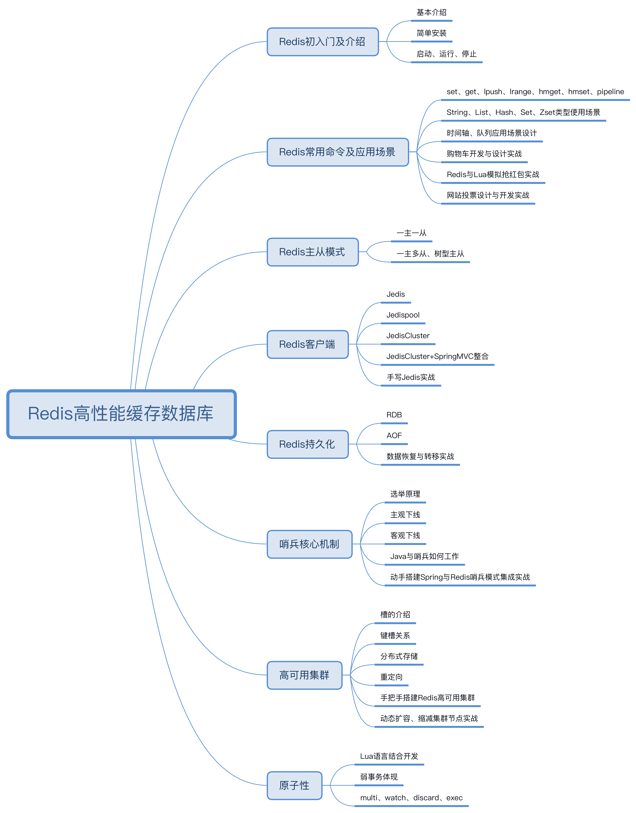

# Redis资料整理

## 资料整理
<b>总结</b>
* [Redis：从应用到底层，一文帮你搞定(史上最全)](https://zhuanlan.zhihu.com/p/339325950)

<b>实现</b>
* [延时队列：基于 Redis 的实现](https://zhuanlan.zhihu.com/p/87113913)
* [玩转redis-简单消息队列](https://www.cnblogs.com/li-peng/p/12659222.html)
* [玩转redis-延时消息队列](https://www.cnblogs.com/li-peng/p/12697110.html)