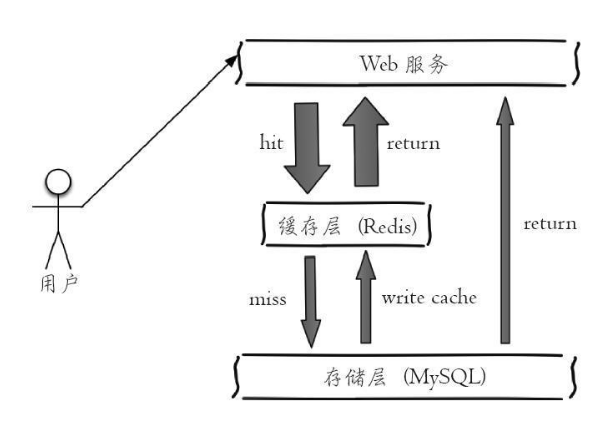
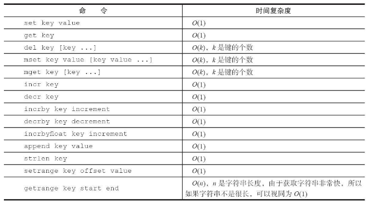

# Redis碎片

## 概要

### 数据结构
* string
* hash
* list
* set
* zset

### 持久化
* RDB
* AOF

### 使用场景
* 缓存
* 排行榜系统
* 计数器应用
* 社交网络
* 消息队列broker

### 键的指令
* keys {pattern}: 查看键列表
* dbsize: 当前db下键的数量
* exists {keys}: 判断key是否存在
* del {keys}: 删除键
* expire {key} {seconds}: 键过期
* ttl {key}: 键生存时间（-1：未设置，-2：不存在）
* type {key}: 值类型

### 内部编码
* object encoding {key}: 查看键对应值的内部编码

### 单线程架构
* 单线程模型
    * 纯内存访问
    * 非阻塞IO(epoll)
    * 单线程避免线程切换和竞态产生的消耗(面向快速执行场景的数据库)
* IO多路复用

## 数据类型

### string
* 设置：SET key value [EX seconds] [PX milliseconds] [NX|XX]
* 初始化(键必须不存在): setnx
* 设置过期时间的值: setex
* 获取值: get
* 批量读写: mset, mget
* 自增自减: incr, decr, incrby, decrby
不常用指令:
* append: 追加值
* strlen: 字符串长度
* getset: 返回原有值并更新值
* setrange: 字符串某位开始进行子部替换
* getrange: 获取子字符串

其他:
* 分布式锁: setnx
* 解决网络性能瓶颈: mset, mget. 批量的数量也需要注意
* string的内部编码：int(8字节长整型), embstr(小于40字节的字符串), raw(40字节及以上字符串)

### hash
映射关系：key field-value
* 设置值: HSET key field value
* 初始化: hsetnx 作用域变为key-field
* 获取值: hget {key} {field}
* 删除field: hdel {keys}
* key的长度: hlen
* 批量设置或者获取(同一个key): hmget, hmset
* 判断是否存在: hexists {key} {field}
* 返回所有field: hkeys {key}
* 返回所有value: hvals {key}
* 返回所有item: hgetall {key}
不常用指令:
* hincrby
* hincrbyfloat
* hstrlen

其他：
* hgetall数量较大时应用hscan
* hash的内部编码: ziplist, hashtable

### list
* 插入: lpush, rpush, linsert
* 删除: lpop, rpop, lrem, ltrim
* 查找: lindex, lrange, llen
* 修改: lset
* 阻塞操作: blpop, brpop 阻塞客户端，直到返回成功

其他:
* list的内部编码: ziplist, linkedlist
* 消息队列实现: lpush + brpop
* 栈实现: lpush + lpop
* 队列实现: lpush + rpop
* 有限集合实现: lpush + ltrim

### set
* 插入: sadd
* 删除: srem, spop(随机弹出n个)
* 查找: scard(计算个数，时间复杂度O(1)), sismember(判断元素是否存在), srandmember(随机取值), smembers(全部查找), sscan

多个集合间的操作:
* 交集: sinter, sinterstore
* 并集: sunion, sunionstore
* 差集: sdiff, sdiffstore

其他:
* smembers比较重，如果元素过多使用sscan
* set的内部编码: intset, hashtable
* 应用场景: 标签，随机抽奖，社交需求

### zset
有序集合，按照score升序排序
* 设置值：ZADD key [NX|XX] [CH] [INCR] score member [score member ...]
查询:
* 升序列表: ZRANGE key start stop [WITHSCORES]
* 降序列表: ZREVRANGE key start stop [WITHSCORES]
* 升序列表(按score): ZRANGEBYSCORE key min max [WITHSCORES] [LIMIT offset count]
* member的index(从零开始): ZRANK key member
* 删除元素(按score): ZREMRANGEBYSCORE key min max

其他：
* WITHSCORES表示是否带score
* 延迟队列实现思路，以时间戳作为score，轮询zrange处理

