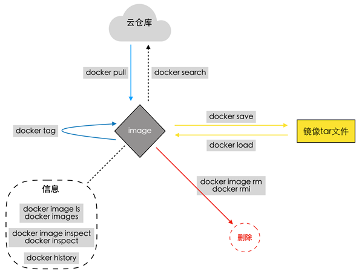
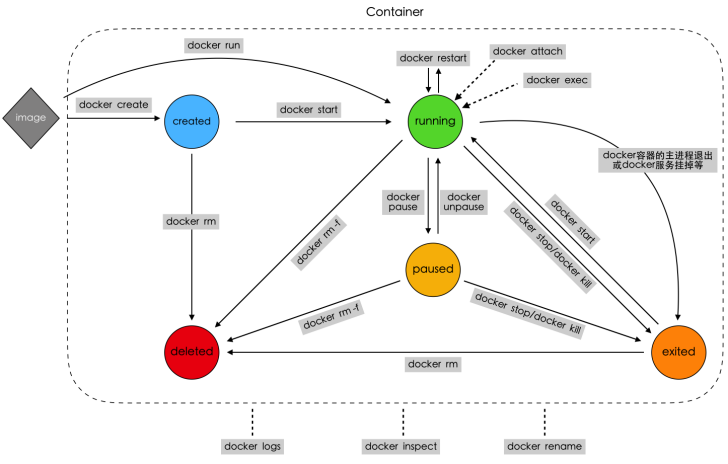

# Docker-Cli

官方文档：https://docs.docker.com/engine/reference/commandline/cli/ 				
指令参考：https://docs.docker.com/engine/reference/commandline/docker/

## 使用镜像



#### 拉取镜像
```bash
docker pull [选项] [Docker Registry 地址[:端口号]/]仓库名[:标签]

```

#### 删除虚悬镜像(dangling image)
```bash
docker image prune

```

#### 查看镜像
```bash
# 指定ls输出格式
docker image ls --format "table {{.ID}}\t{{.Repository}}\t{{.Tag}}"

```

#### docker commit生成镜像
可以通过`docker exec -it {容器}`对某个容器进行操作，然后将修改后的读写层commit成一个镜像

```bash
docker commit \
	--author 'test <admin@test.com>' \
	--message '什么都没修改' \
	web \
	nginx:v2

```

> [!Warning]
> 实际环境中并不会使用到`docker commit`。主要是容器中操作通常会添加大量无关内容，导致镜像臃肿；生成的镜像都是黑箱镜像，对后期维护工作造成困扰			
> 实际工作中一般使用`Dockerfile`进行镜像构建，`docker commit`仅用于线上异常的现场保护


#### 导入和导出镜像
```bash
# 导出镜像(可以将多个镜像一起打包)
docker save -o web.tar nginx	

# 导入镜像
docker load -i web.tar

```
> [!Note]
> 导入和导出只是在没有Registry或Registry不可用的情况下使用


## 使用容器


#### 查看容器
```bash
# 查看容器列表
docker ps 

# 查看某个容器的进程状态
docker top

# 查看容器的实时资源占用情况
docker stats

```

#### 进入容器

```bash
# 进入容器
docker exec -it {容器}

# 添加一个本地输入输出流到容器
docker attach {容器}
```
> [!Warning]
> 进入容器只使用`docker exec -it`的方式。使用`docker attach`时，如果从attach的stdin退出，会导致容器的停止

#### 查看容器和镜像的文件系统差异
```bash
docker diff {容器}

```

#### 导入和导出容器
```bash
# 导出容器
docker export -o web.tar web

# 导入容器为镜像
docker import web.tar nginx:v3

```
> [!Note]
> `docker export`的镜像仅作为快照使用，将会丢弃所有的历史信息和元数据信息（区别于`docker save`导出的镜像）

#### 清理处于终止状态的容器
```bash
docker container prune

```


## inspect
`docker inspect`可以查看docker object（Image，Container，Network，Volume等）的底层信息				

文档参考: https://docs.docker.com/engine/reference/commandline/inspect/ 			

需要熟悉它的`-f`选项，能够快速查找信息
```bash
# 查看容器IP
$ docker inspect --format='{{range .NetworkSettings.Networks}}{{.IPAddress}}{{end}}' $CONTAINER_NAME

# 查看日志路径
$ docker inspect -f '{{.LogPath}}' $CONTAINER_NAME

# 获取容器名
$ docker inspect --format='{{.Config.Image}}' $CONTAINER_NAME

# json格式显式配置
$ docker inspect -f '{{json .NetworkSettings.Ports}}' $CONTAINER_NAME

```


## network
```bash
$ docker network --help

Usage:  docker network COMMAND

Manage networks

Commands:
  connect     Connect a container to a network
  create      Create a network
  disconnect  Disconnect a container from a network
  inspect     Display detailed information on one or more networks
  ls          List networks
  prune       Remove all unused networks
  rm          Remove one or more networks

```
将一个容器接入网络
```bash
$ docker network connect [OPTIONS] NETWORK CONTAINER
```


## 其他指令
```bash
# 查看系统资源占用
docker system df

# 批量删除镜像(空悬镜像为例)
sudo docker images |grep '<none>' | awk '{print $3 }' | xargs sudo docker rmi

```


## 脚本
使用nsenter进入容器的方式，已被exec替代
```bash
#!/bin/sh

if [ $# -gt 0 ]; then
    echo "进入$1"
    container_name=$1
else
    echo -n "输入容器名称:"
    read container_name
fi

PID=$(sudo docker inspect --format "{{ .State.Pid }}" $container_name)
sudo nsenter --target $PID --mount --uts --ipc --net --pid

```
