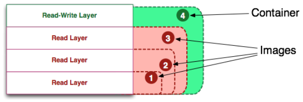

# Docker

## 简介

### 什么是Docker
Docker是一个用于开发、发布和运行应用程序的开放平台。Docker能够将应用程序与基础结构分离，以便快速交付软件。使用Docker可以用与管理应用程序相同的方式管理基础设施。通过利用Docker的方法快速发布、测试和部署代码，可以显著减少编写代码和在生产环境中运行代码之间的延迟。

### 为什么要使用Docker
相比一些传统的虚拟化方式
* 更高效地利用系统资源
* 更快速的启动时间（直接运行于宿主内核，无需启动完整的操作系统）
* 一致的运行方式（镜像提供了除内核外完整的运行时环境，确保了应用运行环境一致性）
* 更轻松的维护和拓展（分层存储，镜像）


## 安装
* 文档地址： https://docs.docker.com/get-docker/
* Ubuntu安装： https://docs.docker.com/engine/install/ubuntu/
* macOS安装： https://docs.docker.com/docker-for-mac/install/
* Windows安装： https://docs.docker.com/docker-for-windows/install/
* WSL2上Docker安装： https://docs.microsoft.com/zh-cn/windows/wsl/tutorials/wsl-containers

### 镜像加速器
可以通过修改`/etc/docker/daemon.json`文件来改变镜像仓库地址
```json
{
    "registry-mirrors": ["<your accelerate address>"]
}            
```
阿里云镜像加速： https://help.aliyun.com/document_detail/60750.html


### 默认开机自启动
```bash
systemctl enable docker
```


## Docker结构
Docker提供工具和平台来管理容器的生命周期。Docker提供一个C/S架构的平台，客户端和服务端通过REST-API通信。


### 服务端（dockerd）
`dockerd`是docker的守护进程（服务端），负责监听Docker API请求并管理Docker对象（如Image、Container、Network、Volume等）。守护进程还可以与其他守护进程通信来管理Docker服务

### 客户端（docker）
`docker`是docker的客户端进程，是docker用户与dockerd交互的主要方式

### 仓库（registry）
`docker registry`是一个集中的存储、分发镜像的服务

### Docker Objects
使用docker时的一些对象资源，如镜像（Image），容器（Container），网络（Network），数据卷（Volume）等

##### 镜像（Image）

操作系统分为内核和用户空间。对于`Linux`，内核启动后，会挂载root文件系统为其提供用户空间支持。而Docker镜像就相当于是一个root文件系统。		
Docker镜像是一个特殊的文件系统，除了提供容器运行时所需的程序、库、资源、配置等文件外，还包含了一些为运行时准备的一些配置参数（如匿名卷、环境变量、用户等）。`镜像不包含任何动态数据，其内容在构建之后也不会被改变`。			

<b>分层存储</b>					

`Docker`充分利用`Union FS`技术，将镜像的文件系统设计成分层存储的架构（镜像并不是一个整体，而是一组文件系统叠加组成）						

镜像构建时，会一层层构建，前一层是后一层的基础。每一层构建完就不会再发生改变，后一层上的任何改变只发生在自己这一层。因此，在构建镜像的时候，需要额外小心，每一层尽量只包含该层需要添加的东西，任何额外的东西应该在该层构建结束前清理掉。		

分层存储的特征还使得镜像的复用、定制变的更为容易。甚至可以用之前构建好的镜像作为基础层，然后进一步添加新的层，以定制自己所需的内容，构建新的镜像。		


##### 容器（Container）

`镜像（Image）`和`容器（Container）`的关系，就像是`可执行程序`和`进程`的关系，镜像是静态的定义，容器是镜像运行时的实体。		

容器的实质是`进程`，但与直接在宿主执行的进程不同，容器进程运行于属于自己的独立的`命名空间`。因此容器可以拥有自己的root文件系统、自己的网络配置、自己的进程空间，甚至自己的用户ID空间。容器内的进程是运行在一个隔离的环境里，使用起来，就好像是在一个独立于宿主的系统下操作一样，这种特性使得容器封装的应用比直接在宿主运行更加安全。	

每一个容器运行时，是以镜像为基础层，在其上创建一个当前容器的存储层，我们可以称这个为容器运行时读写而准备的存储层为`容器存储层`。 容器存储层的生存周期和容器一样，容器消亡时，容器存储层也随之消亡。因此，任何保存于容器存储层的信息都会随容器删除而丢失。



> [!Note]
> 容器的只读层是可共享的，在容器的设计当中，通过同一个Image启动的容器，全部都共享这个image


##### 网络（Network）

容器的网络默认与宿主机、与其他容器都是相互隔离。容器中可以运行一些网络应用(如nginx、web应用、数据库等)，如果要让外部也可以访问这些容器内运行的网络应用，那么就需要配置网络来实现。			

Docker的网络驱动：
* bridge（网桥模式）：默认的网络驱动模式。为每一个容器分配、设置IP等，并将容器连接到一个`docker0`虚拟网桥，通过`docker0`以及Iptables nat表配置与宿主机通信。
* host（主机模式）：容器不会虚拟出自己的网卡，而是直接使用宿主机的IP和端口
* none：关闭容器的网络功能
跨主机：	
* overlay：跨主机的容器通信或者使用`Swarm mode`时使用
* maxvlan：从VM迁移过来，需要mac地址的模式


##### 数据卷（Volume）

按照Docker最佳实践的要求，容器不应该向其存储层内写入任何数据，容器存储层要保持`无状态化`。所有的文件写入操作，都应该使用`数据卷（Volume）`或者绑定宿主目录，在这些位置的读写会跳过容器存储层，直接对宿主（或网络存储）发生读写，其性能和稳定性更高。`数据卷的生存周期独立于容器，容器消亡，数据卷不会消亡。因此，使用数据卷后，容器删除或者重新运行之后，数据却不会丢失。`

