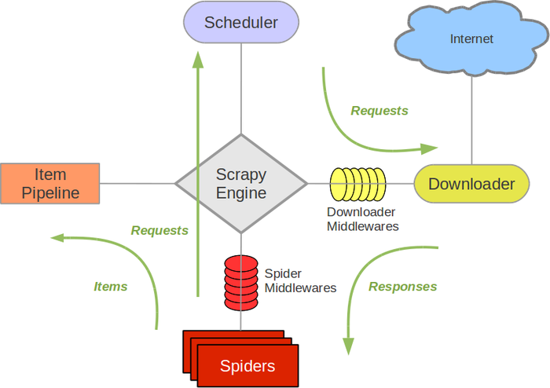

# Scrapy

Scrapy是一个为了爬取网站数据，提取结构性数据而编写的应用框架。 可以应用在包括数据挖掘，信息处理或存储历史数据等一系列的程序中。

## 架构
文档： https://scrapy-chs.readthedocs.io/zh_CN/1.0/topics/architecture.html

## 组件
### Scrapy Engine
引擎负责控制数据流在系统中所有组件中流动，并在相应动作发生时触发事件。 详细内容查看下面的数据流(Data Flow)部分。

### 调度器(Scheduler)
调度器从引擎接受request并将他们入队，以便之后引擎请求他们时提供给引擎。

### 下载器(Downloader)
下载器负责获取页面数据并提供给引擎，而后提供给spider。

### Spiders
Spider是Scrapy用户编写用于分析response并提取item(即获取到的item)或额外跟进的URL的类。 每个spider负责处理一个特定(或一些)网站。

### Item Pipeline
Item Pipeline负责处理被spider提取出来的item。典型的处理有清理、 验证及持久化(例如存取到数据库中)。 

### 下载器中间件(Downloader middlewares)
下载器中间件是在引擎及下载器之间的特定钩子(specific hook)，处理Downloader传递给引擎的response。 
其提供了一个简便的机制，通过插入自定义代码来扩展Scrapy功能。

### Spider中间件(Spider middlewares)
Spider中间件是在引擎及Spider之间的特定钩子(specific hook)，处理spider的输入(response)和输出(items及requests)。 
其提供了一个简便的机制，通过插入自定义代码来扩展Scrapy功能。

### 数据流(Data flow)
Scrapy中的数据流由执行引擎控制，其过程如下:

* 引擎打开一个网站(open a domain)，找到处理该网站的Spider并向该spider请求第一个要爬取的URL(s)。
* 引擎从Spider中获取到第一个要爬取的URL并在调度器(Scheduler)以Request调度。
* 引擎向调度器请求下一个要爬取的URL。
* 调度器返回下一个要爬取的URL给引擎，引擎将URL通过下载中间件(请求(request)方向)转发给下载器(Downloader)。
* 一旦页面下载完毕，下载器生成一个该页面的Response，并将其通过下载中间件(返回(response)方向)发送给引擎。
* 引擎从下载器中接收到Response并通过Spider中间件(输入方向)发送给Spider处理。
* Spider处理Response并返回爬取到的Item及(跟进的)新的Request给引擎。
* 引擎将(Spider返回的)爬取到的Item给Item Pipeline，将(Spider返回的)Request给调度器。
* (从第二步)重复直到调度器中没有更多地request，引擎关闭该网站。

## Scrapy命令行工具
Scrapy是通过`scrapy`命令行工具进行控制的，提供了一些通用性的操作，也提供了自定义command的方法

文档: https://scrapy-chs.readthedocs.io/zh_CN/1.0/topics/commands.html
