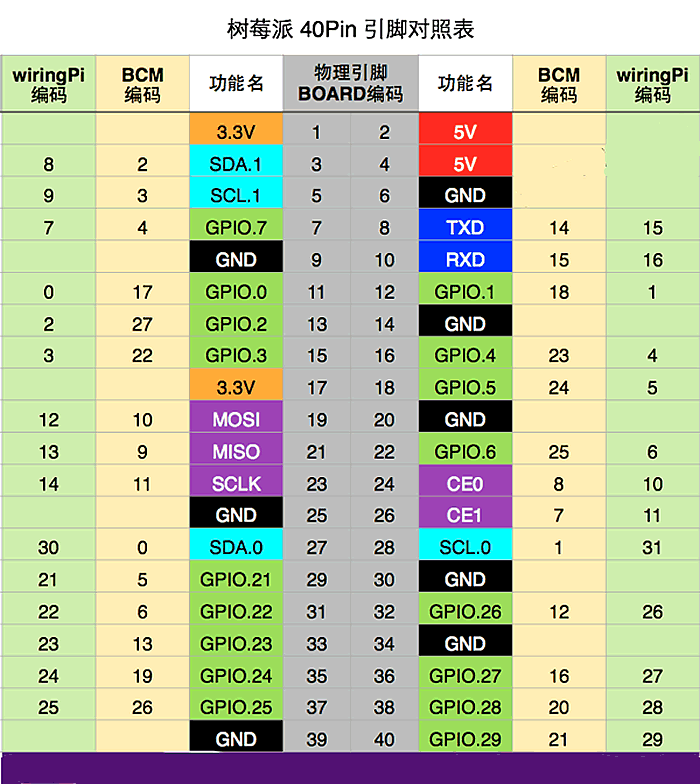

# 树莓派

## 安装
文档已经很成熟了，直接看文档就好 								
Ubuntu Server镜像下载: https://ubuntu.com/download/raspberry-pi			
Ubuntu Server安装教程: https://ubuntu.com/tutorials/how-to-install-ubuntu-on-your-raspberry-pi 			

## 安装docker
官方文档(按照arm64安装): https://docs.docker.com/engine/install/ubuntu/ 						

用户加入docker用户组
```bash
sudo usermod -aG docker <your-user>
```

## 硬件

> 风扇插4,6针脚		


## 资源

* 树莓派中文资讯站: https://shumeipai.nxez.com/
* hostapd配置无线路由器：https://shumeipai.nxez.com/2013/09/11/raspberry-pi-configured-as-a-wireless-router.html


