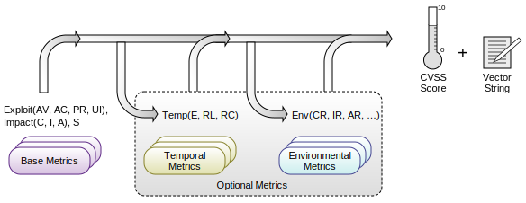

# CVSS

CVSS(Common Vulnerability Scoring System, 通用漏洞评分系统)
是一个行业公开标准，其被设计用来评测漏洞的严重程度，并帮助确定所需反应的紧急度和重要度。
CVSS是安全内容自动化协议（SCAP）的一部分，通常CVSS同CVE一同由美国国家漏洞库（NVD）发布并保持数据的更新。

本文仅对CVSS做一些翻译和简单的解读，详见https://www.first.org/cvss/specification-document

## Metrics
CVSS由三个度量组组成，分别为基础分，临时分和环境分     

评分标准，分数0-10分       

CVSS计算器：https://cvss.js.org

## 基础度量指标(Base Metrics)

### 可利用性指标(Exploitability Metrics)
可利用性指标反映了易受攻击的事物的特征，我们将其正式称为易受攻击组件。
因此，下面列出的每个可利用性指标都应该相对于易受攻击的组件进行评分，并反映导致成功攻击的漏洞的属性。

#### 攻击向量(AV, Attack Vector)
该指标反映漏洞利用可能发生的上下文。攻击者利用漏洞所需的逻辑和物理距离越远，分值越高。
例如通过网络就能利用的漏洞要比需要物理访问才能利用的漏洞潜在的威胁更高。

* 网络(N, Network): 通过网络访问即可利用的漏洞
* 相邻网络(A, Adjacent): 通过相邻网络访问即可利用的漏洞
* 本地网络(L, Local): 通过本地网络访问即可利用的漏洞
* 物理访问(P, Physical): 通过物理访问才可以利用的漏洞

解读
* Network和Adjacent的攻击时刻一定是绑定网络协议栈的
* Local和Physical的攻击不绑定网络协议栈
* Local攻击是通过read/write/exec等操作实现的
* Local需要攻击者登录到本地才能利用漏洞（包括SSH远程登录），或者依赖用户交互来执行攻击该漏洞所需的操作（例如打开邮件附件等）
* Physical需要攻击者物理上接触或操控漏洞组件（例如邪恶女佣攻击，冷启动攻击）

#### 攻击复杂度(AC, Attack Complexity)
该指标描述了攻击者无法控制的情况，这些情况必须存在才能利用该漏洞。攻击复杂度越低，该项分值越高。

* 低(L): 不存在特殊的访问条件或例外情况。攻击者可以对漏洞组件进行反复攻击。
* 高(H): 成功的攻击取决于攻击者控制范围外的条件。
  * 攻击者必须收集有关存在易受攻击目标/组件的环境的知识。例如，需要收集有关目标配置设置、序列号或共享机密的详细信息
  * 攻击者必须为目标环境做好准备，以提高利用漏洞的可靠性。例如，重复利用以赢得比赛条件，或克服先进的利用缓解技术。
  * 攻击者必须将自己注入目标和受害者请求的资源之间的逻辑网络路径，以便读取和/或修改网络通信（例如，中间人攻击）。

解读
* 需要获取一个本地用户账号不是AC为H的条件，已经在下列的PR中考虑了这个因素
* 需要用户交互也不是AC为H的条件，已经在下列的UI中考虑了这个因素

#### 所需权限(PR, Privileges Required)
该指标描述了攻击者在成功利用该漏洞之前必须拥有的权限级别。如果不需要特权，则分数最高。

* 无(N): 攻击者在攻击前未经授权，因此不需要访问易受攻击系统的设置或文件即可进行攻击
* 低(L): 攻击者需要提供基本用户功能的权限，这些功能通常仅影响用户拥有的设置和文件。或者，具有低权限的攻击者只能访问非敏感资源
* 高(H): 攻击者需要对易受攻击的组件提供重要（例如管理）控制的权限，以允许访问组件范围的设置和文件

#### 用户交互(UI, User Interaction)
该指标捕获了除攻击者之外的人类用户参与成功破坏易受攻击组件的需求。该指标确定是否可以仅根据攻击者的意愿利用该漏洞，
或者是否必须以某种方式参与单独的用户（或用户启动的进程）。当不需要用户交互时，基本分数最高。

* 不需要(N): 在没有任何用户交互的情况下，可以利用易受攻击的系统
* 需要(R): 成功利用此漏洞需要用户在利用该漏洞之前采取一些措施。例如，只有在系统管理员安装应用程序的过程中才能成功利用漏洞

解读
* XSS和CSRF漏洞的UI一般选择为R

### 范围指标(S, Scope)
范围度量捕获一个易受攻击组件中的漏洞是否影响其安全范围以外组件中的资源。
范围只有一种Scope指标
* 无改变(U, Unchanged): 被利用的漏洞只能影响由同一安全机构(security authority)管理的资源。在这种情况下，易受攻击的组件和受影响的组件要么相同，要么由同一安全机构管理
* 有改变(C, Changed): 被利用的漏洞可能会影响由易受攻击组件的安全机构管理的安全范围以外的资源。在这种情况下，易受攻击的组件和受影响的组件是不同的，由不同的安全机构管理。

解读
* 只有因为某个设备的漏洞导致另一台设备连带遭受攻击，或者直接成为攻击目标（XSS）是，scope才是changed。
* 一台独立设备一般至少存在一个scope，所以一个漏洞导致两台不同的设备遭受攻击，那么scope一般是changed。
* XSS漏洞的scope一般是changed。

### 影响指标(Impact Metrics)
影响指标捕捉成功利用漏洞对组件的影响，该组件遭受与攻击最直接、最可预测的最坏结果。也就是影响指标只根据受成功攻击导致的最直接和可预见结果中最坏的情况进行打分。

如果未发生范围更改，影响指标应反映对易受攻击组件的机密性(C)、完整性(I)和可用性(A)影响。然而，如果发生范围变更，则影响指标应反映对易受攻击组件或受影响组件的机密性、完整性和可用性影响，以后果最严重的为准。

#### 机密性影响(C, Confidentiality)
该指标衡量由于成功利用漏洞而对软件组件管理的信息资源的机密性的影响。机密性是指将信息访问和披露限制为仅授权用户，以及防止未经授权的用户访问或披露给未经授权的用户。
当受影响部件的损失最高时，基本分数最高。

* 高(H): 完全失去机密性，导致受影响组件内的所有资源泄露给攻击者。或者只能获取一些受限信息，但披露的信息会产生直接、严重的影响(例如攻击者窃取管理员密码或web服务器的加密私钥)
* 低(L): 有一些机密性的损失。获得了对某些受限信息的访问，但攻击者无法控制获得的信息，或者损失的数量或种类是有限的。信息披露不会对受影响的组件造成直接、严重的损失。
* 无(N): 受影响的组件内没有机密性损失。

解读
* 高敏感性的信息机密性丧失即可导致影响为H，高敏感性信息指的是高权限用户口令，系统私钥，用户重要个人隐私信息

#### 完整性影响(I, Integrity)
该指标衡量成功利用的漏洞对完整性的影响。完整性是指信息的可信度和准确性。当受影响部件的后果最高时，基础分数最高。

* 高(H): 完全丧失完整性或完全失去保护。例如，攻击者能够修改受影响组件保护的任何/所有文件。或者，只能修改某些文件，但恶意修改会对受影响的组件造成直接、严重的后果
* 低(L): 可以修改数据，但攻击者无法控制修改的结果，或者修改的数量有限。数据修改不会对受影响的组件产生直接、严重的影响。
* 无(N): 受影响部件内没有完整性损失。

#### 可用性影响(A, Availability)
该指标衡量成功利用漏洞对受影响组件可用性的影响。由于可用性是指信息资源的可访问性，因此消耗网络带宽、处理器周期或磁盘空间的攻击都会影响受影响组件的可用性。当受影响部件的后果最高时，基础分数最高。

* 高(H): 完全丧失可用性，导致攻击者能够完全拒绝访问受影响组件中的资源；这种损失要么是持续的（当攻击者持续进行攻击时），要么是持久的（即使在攻击完成后，情况仍然存在）。 
* 低(L): 性能降低或资源可用性中断。即使可能重复利用该漏洞，攻击者也无法完全拒绝向合法用户提供服务。受影响组件中的资源要么始终部分可用，要么仅在部分时间完全可用，但总的来说，对受影响组件没有直接、严重的后果。
* 无(N): 对受影响组件内的可用性没有影响。

解读
* 当攻击者有能力导致部分可用性丧失，但可用性的丧失会对受影响的组件造成严重后果的情况，影响为H。(例如，攻击者无法中断现有连接，但可以阻止新连接；攻击者可以重复利用漏洞，在每次成功攻击中，该漏洞仅泄漏少量内存，但重复利用后会导致服务完全不可用)

## 参考
* https://www.first.org/cvss/specification-document
* https://cvss.js.org 