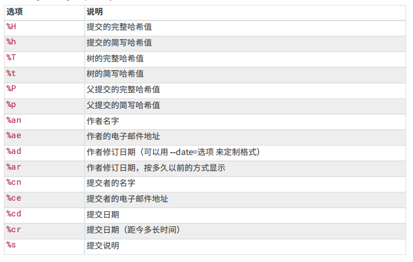

# git笔记


## 常用配置
`Git`自带一个`git config`的工具来帮助设置控制`Git`外观和行为的配置变量。这些变量存储在三个不同的位置：
* `/etc/gitconfig`文件: 包含系统上每一个用户及他们仓库的通用配置。如果在执行`git config`时带上`--system`选项，修改的就是该文件;
* `~/.gitconfig`或`~/.config/git/config`文件：只针对当前用户。可以传递`--global`选项读写此文件，这会对当前用户的所有仓库生效;
* 当前使用仓库的`.git/config`：只针对该仓库。可以传递`--local`选项读写此文件（默认情况）;

### 配置示例
```ini
[user]
	email = xxx@test.com
	name = xxx
[alias]
	lg = log --color --graph --pretty=format:'%Cred%h%Creset -%C(yellow)%d%Creset %s %Cgreen(%cr) %C(bold blue)<%an>%Creset' --abbrev-commit
	tlg = log --pretty=format:'%s(%an)' -n 1

[credential]
    helper = store --file /home/$USER/.git-credentials
    helper = cache --timeout 900
```


## 说明
<b>文件状态变化</b>


## 应用案例

### 查看代码量
```bash
# 项目代码行数
git log  --pretty=tformat: --numstat | awk '{ add += $1; subs += $2; loc += $1 - $2 } END { printf "added lines: %s, removed lines: %s, total lines: %s\n", add, subs, loc }' -
```
<b>`git log --pretty`参数格式</b>



