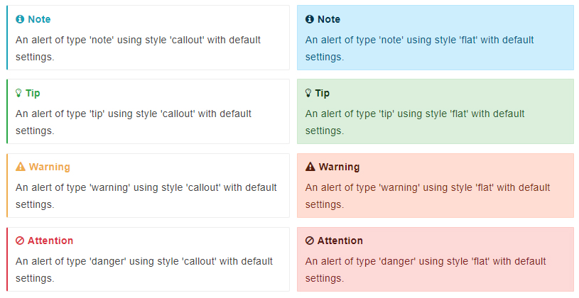

# Gitbook

<strong>GitBook</strong>是一个基于 Node.js 的命令行工具，可使用 Github/Git 和 Markdown 来制作精美的电子书

## 安装
```bash
sudo npm install -g gitbook-cli
sudo npm install -g gitbook
```
检查是否安装完成
```bash
gitbook -V
```

## 使用
常用的命令：
* `gitbook init` 初始化书籍
* `gitbook serve` 启动一个本地服务
* `gitbook pdf` 生成PDF文件

### 初始化
```bash
~$ mkdir your_book	# 创建一个新目录
~$ cd your_book/	# 切换到目标目录下
your_book$ gitbook init 	# 初始化项目
warn: no summary file in this book 
info: create README.md 
info: create SUMMARY.md 
info: initialization is finished 
your_book$ tree . 	# 当前目录结构
.
├── README.md
└── SUMMARY.md
```

### 编译书籍
编译书籍，目录下生成_book/目录
```bash
gitbook build
```

编译书籍，并启动一个web服务，默认本地端口4000
```bash
gitbook serve
```


## 配置及插件
在书籍根目录下的`book.json`文件中添加配置，添加插件后需要执行`gitbook install`以安装插件

### gitbook自带插件
Gitbook 默认带有 5 个插件：
* highlight: 代码高亮
* search: 导航栏查询
* sharing: 右上角分享功能
* font-settings: 左上角字体调整
* livereload: gitbook实时重载


### 插件添加
下例为添加search-pro，并移除自带的lunr和search插件的配置（gitbook自带插件不支持中文搜索)
```json
{
	"plugins": [
		"-lunr", "-search", "search-pro"
	]
}
```


### 插件列表
<b>搜索</b>
* search-pro: 支持中文的搜索插件，和lunr，search冲突。

<b>边栏</b>
* expandable-chapters 和 chapter-fold: 边栏折叠，两者各有缺陷，合用互补
* splitter: 边栏宽度可调节

<b>页面组件</b>
* back-to-top-button: 回到顶部
* page-treeview: 页面顶部添加页面目录
* page-toc-button: 右上角添加悬浮目录

配置:
```json
	"pluginsConfig": {
		"page-treeview": {
			"minHeaderCount": "2",
			"minHeaderDeep": "3"
		}
	}
```

<b>内容</b>
* todos: 支持todo-list语法
* lightbox: 图片弹框显示
* hide-element: 隐藏页面元素
* code: 显示代码行号，代码复制按钮
* advanced-emoji: 支持emoji，[支持表情列表](https://www.webfx.com/tools/emoji-cheat-sheet/)
* alerts: 将块引用转换为漂亮的警报。[使用说明](https://www.npmjs.com/package/gitbook-plugin-alerts)
* flexible-alerts: 同样是美化块引用，语法不同，可以混用。[使用说明](https://www.npmjs.com/package/gitbook-plugin-flexible-alerts)


配置:
```json
	"pluginsConfig": {
		"hide-element": {
            "elements": [".gitbook-link", ".treeview__container-title"]
        }
	}
```

npmjs.com上搜索gitbook-plugin以查找更多插件，[链接](https://www.npmjs.com/search?q=gitbook-plugin)


### flexible-alerts插件
效果:


```markdown
> [!Note]	
> An alert of type 'note' using global style 'callout'.
```
```markdown
> [!Note|style:flat]
> An alert of type 'note' using alert specific style 'flat' which overrides global style 'callout'
```

> [!Note]
> An alert of type 'note' using global style 'callout'.					


> [!Note|style:flat]
> An alert of type 'note' using alert specific style 'flat' which overrides global style 'callout'			

| Key             | Allowed value                                           |
| --------------- | ------------------------------------------------------- |
| style           | One of follwowing values: callout, flat                 |
| label           | Any text                                                |
| icon            | A valid Font Awesome icon, e.g. 'fa fa-info-circle'     |
| className       | A name of a CSS class which specifies the look and feel |
| labelVisibility | One of follwowing values: visible (default), hidden     |
| iconVisibility  | One of follwowing values: visible (default), hidden     |

​		

```markdown
> [!Tip|style:flat|label:My own heading|iconVisibility:hidden]
> An alert of type 'tip' using alert specific style 'flat' which overrides global style 'callout'.
> In addition, this alert uses an own heading and hides specific icon.
```

> [!Tip|style:flat|label:My own heading|iconVisibility:hidden]
> An alert of type 'tip' using alert specific style 'flat' which overrides global style 'callout'.
> In addition, this alert uses an own heading and hides specific icon.


## 参考文档
* [gitbook教程](https://zhuanlan.zhihu.com/p/34946169)
* [gitbook常用插件](https://segmentfault.com/a/1190000019806829)
* [gitbook插件](https://www.cnblogs.com/mingyue5826/p/10307051.html)
